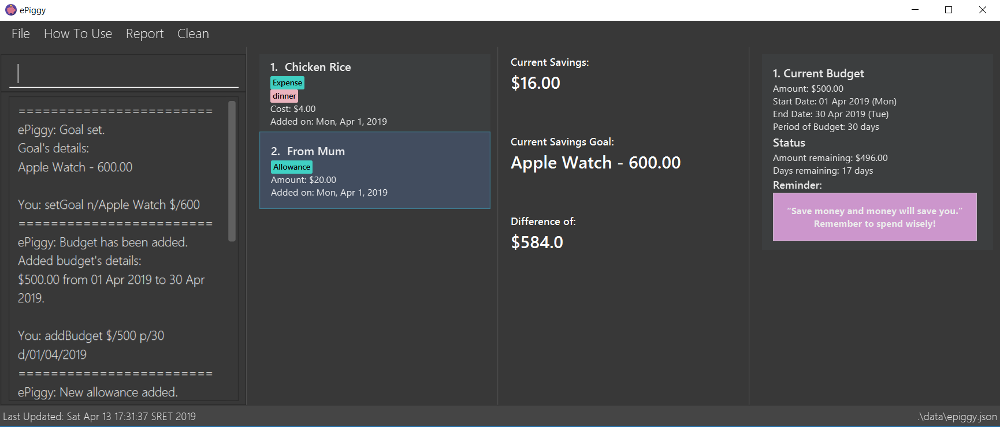

= ePiggy
ifdef::env-github,env-browser[:relfileprefix: docs/]

https://travis-ci.org/CS2103-AY1819S2-W17-4/main[image:https://travis-ci.org/se-edu/addressbook-level4.svg?branch=master[Build Status]]
https://ci.appveyor.com/project/rahulb99/main-3fxt5/branch/master[image:https://ci.appveyor.com/api/projects/status/lli2h4t2ngcwq0ky/branch/master?svg=true[Build Status]]
https://coveralls.io/github/CS2103-AY1819S2-W17-4/main?branch=master[image:https://coveralls.io/repos/github/CS2103-AY1819S2-W17-4/main/badge.svg?branch=master[Coverage Status]]
https://www.codacy.com/app/rahulb99/main?utm_source=github.com&amp;utm_medium=referral&amp;utm_content=CS2103-AY1819S2-W17-4/main&amp;utm_campaign=Badge_Grade[image:https://api.codacy.com/project/badge/Grade/678fd7d82cbd4e07a7ca899447c96d45[Codacy Badge]]
https://app.netlify.com/sites/flamboyant-jennings-fec7ca/deploys[image:https://api.netlify.com/api/v1/badges/bb4108e1-6558-4a6c-aece-24ee9561ce0e/deploy-status[Netlify Status]]

ifdef::env-github[]

endif::[]

ifndef::env-github[]
image::images/Ui.png[width="600"]
endif::[]

Have you ever felt that regular expense trackers are too complicated? We understand! +
Introducing to you, ePiggy - a simplified expense tracker application targeted specifically towards the needs of students! We're here to make managing money a breeze for even the youngest students.

Interested to know more? Visit our <<UserGuide#, User Guide>> to find out more! +
ePiggy is an open source project that welcomes contributions from the community. If you would like to contribute, visit the <<DeveloperGuide#, Developer Guide>> to get started!

== Site Map

* <<UserGuide#, User Guide>>
* <<DeveloperGuide#, Developer Guide>>
* <<AboutUs#, About Us>>
* <<ContactUs#, Contact Us>>

== Acknowledgements

* The original source of the code (https://github.com/se-edu/addressbook-level4[AddressBook-Level4]) was created by the https://github.com/se-edu/[SE-EDU] initiative.
* Some parts of this sample application were inspired by the excellent http://code.makery.ch/library/javafx-8-tutorial/[Java FX tutorial] by
_Marco Jakob_.
* Libraries used: https://github.com/TestFX/TestFX[TextFX], https://github.com/FasterXML/jackson[Jackson], https://github.com/google/guava[Guava], https://github.com/junit-team/junit5[JUnit5]

== Licence : link:LICENSE[MIT]
